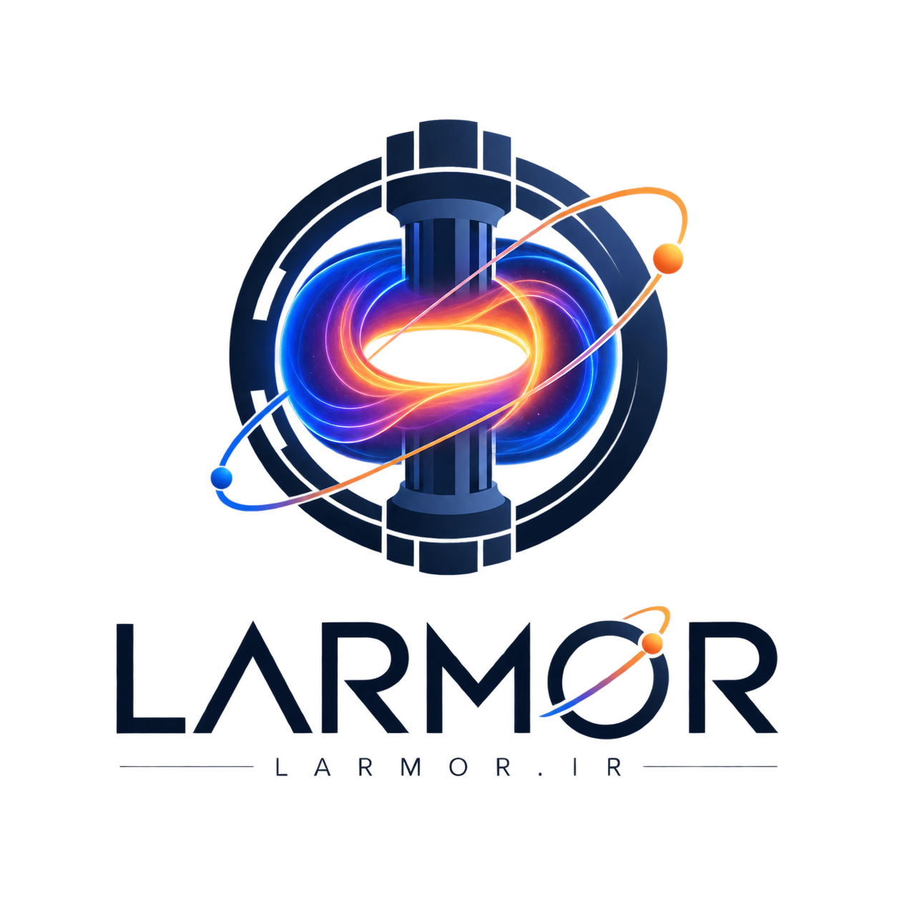

<p align="center">
  
</p>

<h1 align="center">Larmor</h1>

<p align="center">
  <strong>Plasma. Physics. Fusion.</strong><br>
  A bilingual (Persian and English) website about plasma physics and fusion energy.
</p>

<p align="center">
  <a href="https://larmor.ir">larmor.ir</a>
</p>

## About

Larmor is the personal website of [AmirErfan Bohlouli](https://larmor.ir/#about), an MSc student in Nuclear Engineering (Fusion) at Amirkabir University of Technology (Tehran Polytechnic). It collects short explainers, article summaries, a list of learning resources and an interactive Langmuir probe simulator.

The whole site is a single static HTML file. There is no framework, no package manager and no build step.

## Features

- **Two languages.** Persian (the default, right-to-left) and English (left-to-right). The switch in the corner changes the text, the layout direction and the fonts. The choice is remembered in the browser.
- **Six pages.** Home, What is Larmor?, Articles, Education, About and Contact. Each page has its own URL hash (for example `#articles`), so links and the browser's back button work.
- **Larmor explainer.** The Larmor frequency (`ω_L = qB/m`) and the Larmor radius (`r_L = mv/qB`), and why they matter for confining plasma in tokamaks and stellarators.
- **Articles.** A summary of F. F. Chen's lecture notes on Langmuir probe diagnostics, with a PDF download.
- **Education.** Reference books, online courses and software for plasma physics and fusion engineering (Python, COMSOL, BOUT++, MATLAB), plus the simulator below.
- **Visit counters.** The footer shows visits today and total visits. A visit is counted once per browser session. If the counting service can't be reached, the numbers show "—" and the rest of the page is unaffected.
- **Accessibility.** Skip link, ARIA labels, keyboard support (Esc closes the menu and dialogs), visible focus outlines and reduced-motion support.
- **Link previews and SEO.** Open Graph and Twitter card tags, plus `sitemap.xml`.

## Langmuir probe simulator

The simulator is on the Education page, under **Simulation**. It shows what stray capacitance in the cabling does to a Langmuir probe measurement.

With a continuous voltage sweep, the current through the stray capacitance (`C·dV/dt`) adds a persistent error to the measured current. With a stepped sweep, that current becomes a short transient at each step, and waiting a few time constants before sampling lets it decay.

You can adjust:

- the electron temperature `Te` and the relative plasma density `ne`
- the time constant `τ = R·C` of the stray capacitor
- the dwell time on each voltage step (as a rule of thumb, after 5τ the capacitor is more than 99% settled)
- the animation speed

Run a continuous sweep and a stepped sweep, then compare the electron temperature each one estimates with the true input value.

This is a lightweight educational model, not a circuit-accurate (SPICE) simulation. The I–V curve is a simplified Maxwellian exponential, the capacitive transient decays as `exp(−t/τ)`, and the ratio of electron to ion saturation current is set smaller than the physical value (∝ √(mᵢ/mₑ)) so the plot stays readable. Everything runs in the browser.

## Repository layout

| File | Purpose |
| --- | --- |
| `index.html` | The whole site: markup, styles, scripts, translations and article data |
| `logo.png` | Logo shown in the header and used for link previews |
| `Langmuir Probe Diagnostics - F.F.Chen.pdf` | PDF offered for download on the Articles page |
| `sitemap.xml` | Sitemap for search engines |
| `CNAME` | Custom domain for GitHub Pages (`larmor.ir`) |

## Run locally

There is nothing to install. Clone the repository and open `index.html` in a browser, or serve the folder:

```bash
git clone https://github.com/amirerfanx/larmor.git
cd larmor
python3 -m http.server 8000
```

Then open <http://localhost:8000>.

Web fonts, the header logo, the photos on the "What is Larmor?" page and the visit counters are loaded from external URLs, so those parts need an internet connection. The rest of the page, including the simulator, works offline. Opening the site locally also counts as a visit.

## Customizing

Everything lives in `index.html`.

- **Text and translations.** Visible strings are in the `translations` object (`fa` and `en`). Elements refer to them with `data-i18n="section.key"`.
- **Add an article.** Add an entry to `articlesData` with an `id` and `fa` / `en` objects (`title`, `date`, `excerpt`, `content` as HTML, and optionally `file` with `name` and `url`). The Articles page picks it up automatically.
- **Add a page.** Add a `<section class="page" id="page-name">`, a menu button with `data-page="name"`, and add `name` to `VALID_PAGES`.
- **Colors.** The palette is a set of CSS variables in `:root` (`--purple`, `--magenta`, `--cyan` and so on).
- **Visit counters.** `COUNTER_NS` is the counter namespace and `COUNTER_TZ` is the time zone whose midnight resets the daily count. Counting uses the free [Abacus](https://abacus.jasoncameron.dev) API. The namespace is visible in the page source, so anyone could raise the numbers. Treat them as a rough indication, not exact analytics.

## Deployment

The site is hosted on GitHub Pages, and the `CNAME` file sets the custom domain `larmor.ir`. To publish your own copy, enable Pages under **Settings → Pages** and choose the `main` branch and the root folder.

If you fork the repository for your own site:

1. Replace or delete `CNAME`.
2. Change `COUNTER_NS` so your visits don't add to this site's counters.
3. Update the absolute URLs that point at this repository: the Open Graph image in `<head>`, the logo in the header and the PDF link in `articlesData`. Update `sitemap.xml` as well.
4. Replace the text, articles and contact details with your own.

## Feedback

Found a physics mistake, a typo or a translation problem? [Open an issue](https://github.com/amirerfanx/larmor/issues) or send a pull request.

## Credits

- Lecture notes on Langmuir probe diagnostics by Prof. Francis F. Chen (UCLA). The PDF is included for educational reference, and all rights remain with the author.
- Fonts: [Orbitron](https://fonts.google.com/specimen/Orbitron), [Vazirmatn](https://fonts.google.com/specimen/Vazirmatn) and [Inter](https://fonts.google.com/specimen/Inter), served by Google Fonts.
- Photos on the "What is Larmor?" page: [Unsplash](https://unsplash.com).
- Visit counting: [Abacus](https://abacus.jasoncameron.dev) by Jason Cameron.

## Author

AmirErfan Bohlouli · [larmor.ir](https://larmor.ir) · [Contact](https://larmor.ir/#contact) · [@amirerfanx](https://github.com/amirerfanx) on GitHub
